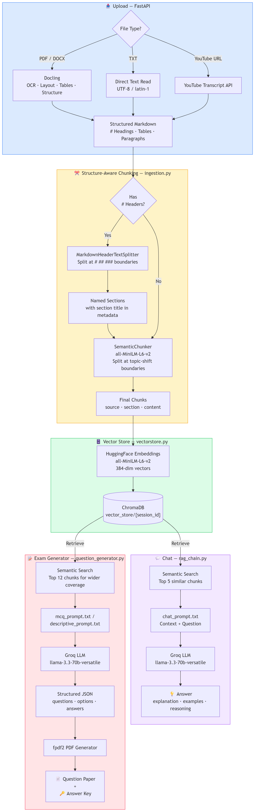

# EduCare RAG — Educational AI Agent

An AI-powered study assistant that lets you upload study material, chat with it, and auto-generate exam papers using Retrieval-Augmented Generation (RAG).

---

## Architecture



---

## Features

- **Upload Study Material** — PDF, DOCX, TXT or YouTube URLs
- **Advanced PDF Parsing** — Scanned docs, tables, images via Docling (OCR + layout analysis)
- **Structure-Aware Chunking** — Header-first splits, then semantic chunking within sections
- **Chat with Material** — Context-grounded answers with LLM reasoning and explanation
- **Generate Exam Papers** — MCQ or Descriptive with configurable marks, duration, difficulty
- **Download PDFs** — Question Paper and Answer Key as separate PDFs

---

## Tech Stack

| Layer | Technology |
|-------|-----------|
| Frontend | Streamlit |
| Backend | FastAPI |
| LLM | Groq (`llama-3.3-70b-versatile`) |
| Embeddings | HuggingFace (`all-MiniLM-L6-v2`) |
| PDF Parsing | Docling (OCR + layout + tables) |
| Chunking | MarkdownHeaderTextSplitter → SemanticChunker |
| Vector DB | ChromaDB |
| RAG Framework | LangChain |
| PDF Generation | fpdf2 |

---

## Project Structure

```
EduCare_RAG/
├── main.py                       # FastAPI backend
├── .env.example                  # Environment variable template
├── requirements.txt              # Dependencies
├── backend/
│   ├── vectorstore.py            # Vector store (embeddings + ChromaDB)
│   ├── ingestion.py              # Docling parsing + chunking
│   ├── rag_chain.py              # RAG Q&A chain
│   ├── question_generator.py     # Exam paper generation
│   ├── pdf_generator.py          # PDF export
│   └── schemas.py                # Request/response models
├── frontend/
│   └── app.py                    # Streamlit UI
└── prompts/
    ├── chat_prompt.txt
    ├── mcq_prompt.txt
    └── descriptive_prompt.txt
```

---

## Getting Started

### 1. Clone & install

```bash
git clone https://github.com/11Urvesh/EduCare-Educational-RAG-Agent.git
cd EduCare-Educational-RAG-Agent
python -m venv venv
venv\Scripts\activate
pip install -r requirements.txt
```

### 2. Set up environment variables

```bash
copy .env.example .env
```

Add your Groq API key inside `.env` — get one at [console.groq.com](https://console.groq.com):

```
GROQ_API_KEY=your_groq_api_key_here
HF_HUB_DISABLE_SYMLINKS_WARNING=1
```

### 3. Pre-download Docling models *(first-time only, ~500MB)*

```bash
python -c "from docling.document_converter import DocumentConverter; DocumentConverter()"
```

> **Windows:** Enable Developer Mode (`Settings → For Developers → Developer Mode → ON`) before this step.

### 4. Run

**Terminal 1 — Backend:**
```bash
uvicorn main:app --reload
```

**Terminal 2 — Frontend:**
```bash
streamlit run frontend/app.py
```

> Start backend first. Frontend opens at `http://localhost:8501`.

---

## API Endpoints

| Method | Endpoint | Description |
|--------|----------|-------------|
| GET | `/health` | Health check |
| POST | `/upload` | Upload file or YouTube URL |
| POST | `/chat` | Ask a question |
| POST | `/generate-questions` | Generate exam paper |
| DELETE | `/session/{id}` | Delete a session |

---

## Notes

- Sessions are not persisted — vector stores clear on server restart
- YouTube URLs must have captions enabled
- Edit files in `prompts/` to tune LLM behaviour without touching Python code
